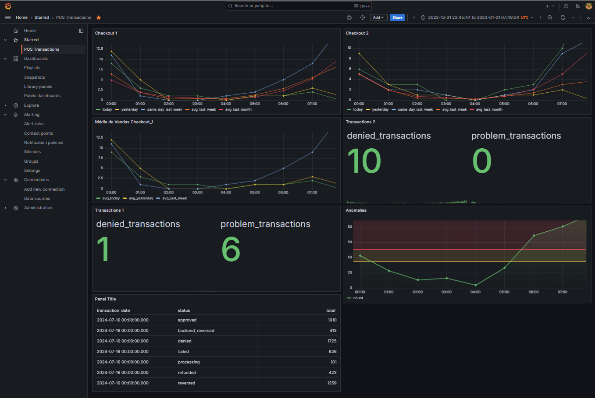

# Solution to the Challenge: Transaction Incident Alert

To implement a simple monitoring system with real-time alerts and notifications, we follow the steps below. The solution includes an endpoint for receiving transaction data, processing and analyzing the data, a model for detecting anomalies, and a system for automatically reporting anomalies.

## 1. Project Structure

### 1.1. Project Directory

transaction_monitoring/
│
├── endpoint.py
├── db_secrets.py
├── grafico_vendas.py
├── requirements.txt
├── docker-compose.yml
├── monitor.py
├── notification.py
└── send_request.sh

### 1.2. Dependencies

- `requirements.txt`

### 1.3. Database Configuration

- `db_secrets.py`

## 2. Endpoint to Receive Transaction Data

- `endpoint.py`

## 3. SQL Query, Sales Chart and Anomaly Monitoring

- Grafana:

## 4. Anomaly Monitoring

- `monitor.py`

## 5. Notification System

- `notification.py`

## 6. Script for Sending Test Requests

- `send_request.sh`

## 7. Docker Compose

- `docker-compose.yml`
