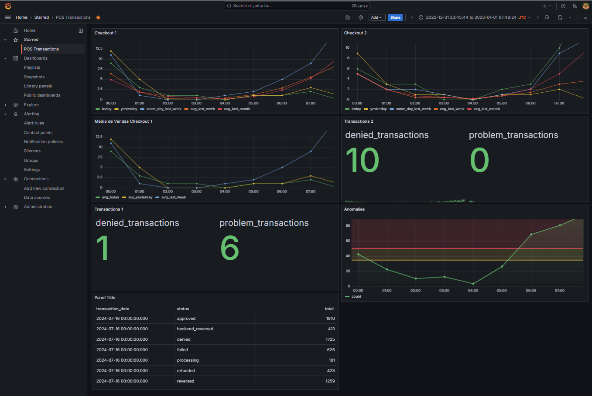

Solução para o Desafio: Alerta de Incidente em Transações

Para implementar um sistema de monitoramento simples com alerta em tempo real e notificações, seguimos os passos abaixo. A solução inclui um endpoint para receber dados de transação, processamento e análise dos dados, um modelo para detectar anomalias e um sistema para reportar as anomalias automaticamente.

1. Estrutura do Projeto

1.1. Diretório do Projeto

transaction_monitoring/
│
├── endpoint.py
├── db_secrets.py
├── grafico_vendas.py
├── requirements.txt
├── docker-compose.yml
├── monitor.py
├── notification.py
└── send_request.sh

Dependências
requirements.txt

Configuração do Banco de Dados
db_secrets.py

1. Endpoint para Receber Dados de Transação
endpoint.py

2. Consulta SQL, Gráfico de Vendas e Monitoramento de anomalias

Grafana:

3. Monitoramento de Anomalias

monitor.py

4. Sistema de Notificação

notification.py

5. Script para Envio de Requisições de Teste

send_request.sh

6. Docker Compose

docker-compose.yml

