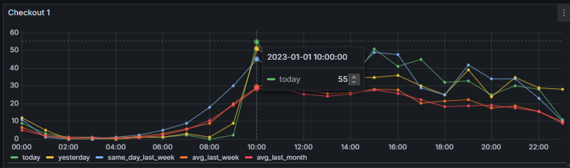
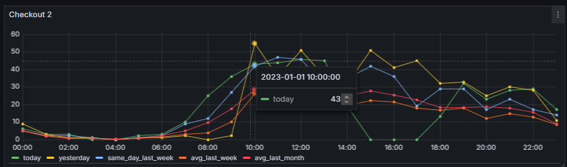
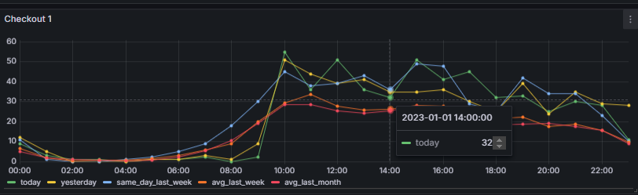
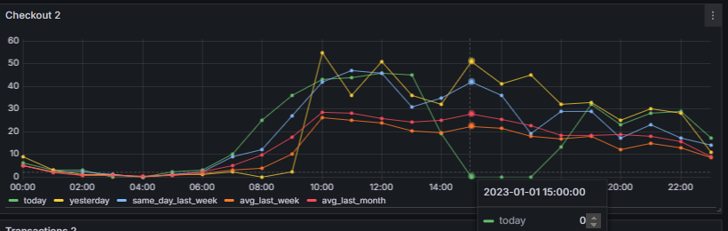
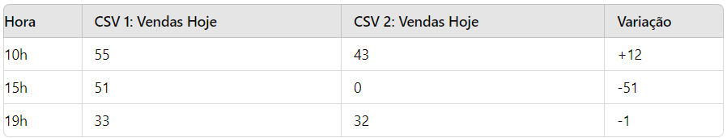
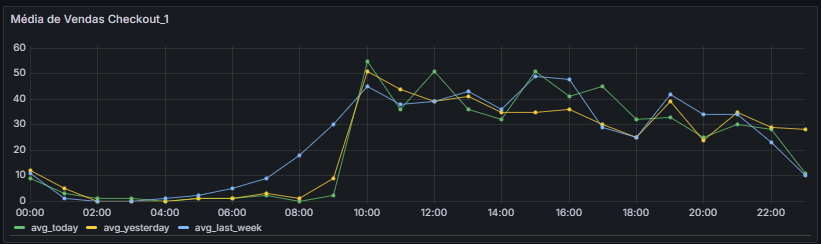
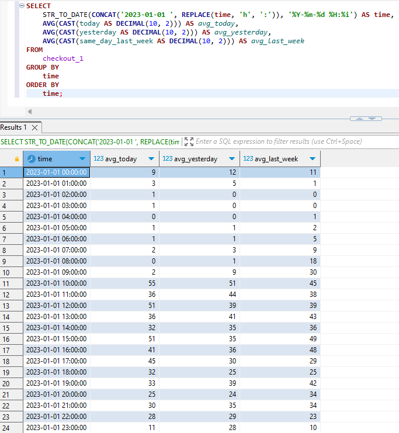
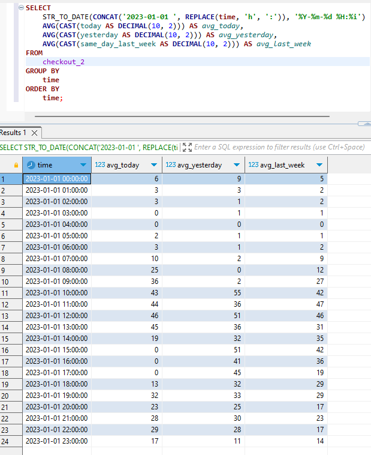
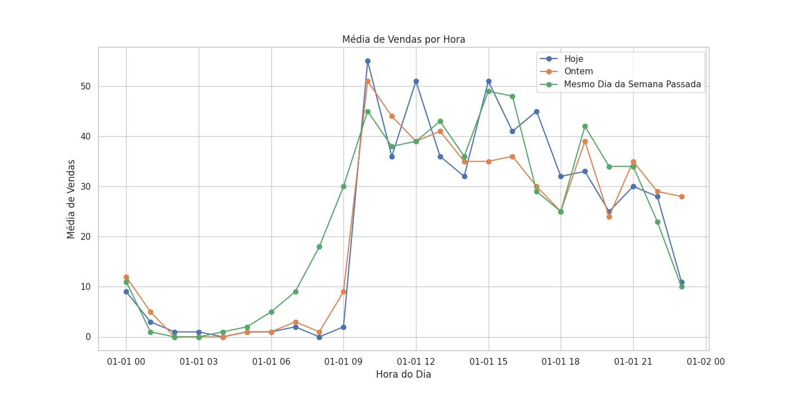

#Objetivo

O objetivo deste projeto é criar um sistema de monitoramento de transações que registre e analise o status das transações em um banco de dados MySQL, além de enviar alertas em caso de anomalias.

Análise dos Dados
Comparação Geral
Os dados dos dois arquivos CSV mostram o número de vendas do POS por hora, permitindo uma comparação entre as vendas de hoje (today), ontem (yesterday), e a mesma data da semana anterior (same_day_last_week), além da média da última semana (avg_last_week) e da média do último mês (avg_last_month).

1. Tendências Gerais
Picos de Vendas: Observa-se um pico de vendas entre as 10h e 15h em ambos os dias. 
Por exemplo, hoje, a venda mais alta foi às 10h com 55 vendas no CSV 1

 e 43 no CSV 2.

 

Queda nas Vendas: Após as 15h, as vendas começam a diminuir

Especialmente no CSV 2, onde houve um zero em várias horas da tarde.

2. Comparação entre os CSVs

CSV 1 vs CSV 2: O CSV 1 geralmente apresenta números de vendas mais altos do que o CSV 2. Isso pode indicar uma diferença na atividade do negócio ou na eficácia das vendas em dias diferentes.

Anomalias Notáveis:

CSV 1: O horário das 10h apresenta um aumento significativo de vendas (55), contrastando com o que seria esperado. Isso sugere uma anomalia, já que está muito acima da média para a maioria das horas.

CSV 2: A partir das 15h, as vendas caem drasticamente, com zeros, o que também pode indicar uma anomalia ou uma interrupção no serviço.
3. Métricas Específicas

4. Análise de Anomalias

Anomalia Identificada

A anomalia mais evidente é a drástica queda nas vendas após as 15h no CSV 2, onde as vendas caem a zero. Isso pode ser um indicativo de:

- Interrupção de Sistema: O sistema POS pode ter enfrentado problemas técnicos após esse horário.
- Mudança no Comportamento do Cliente: Uma mudança no fluxo de clientes ou horário de funcionamento pode ter ocorrido.
- Eventos Externos: Fatores externos como feriados ou eventos na região podem ter impactado as vendas.

5. Consulta SQL para Análise

Para investigar mais a fundo, podemos fazer uma consulta SQL para calcular a média de vendas por hora e verificar se alguma hora específica teve uma variação extrema:

Gráfico de Vendas

Um gráfico pode ser gerado para visualizar as vendas ao longo das horas para identificar picos e quedas. Neste caso utilizamos o código grafico_vendas.py para gerar o gráfico.

Conclusão

Pico de Vendas: O horário das 10h é um ponto de destaque, mostrando um volume de vendas bem acima da média.

Queda Anormal: A partir das 15h no CSV 2, as vendas caem drasticamente, o que pode ser considerado uma anomalia e requer investigação adicional.

Comparação de Dados: A análise permite identificar tendências e padrões que podem ser usados para otimizar estratégias de vendas futuras e entender o comportamento do cliente.